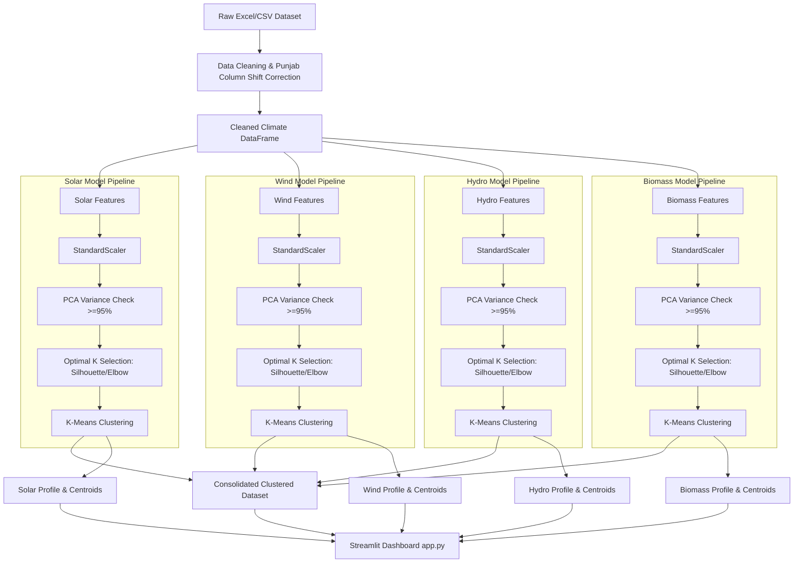
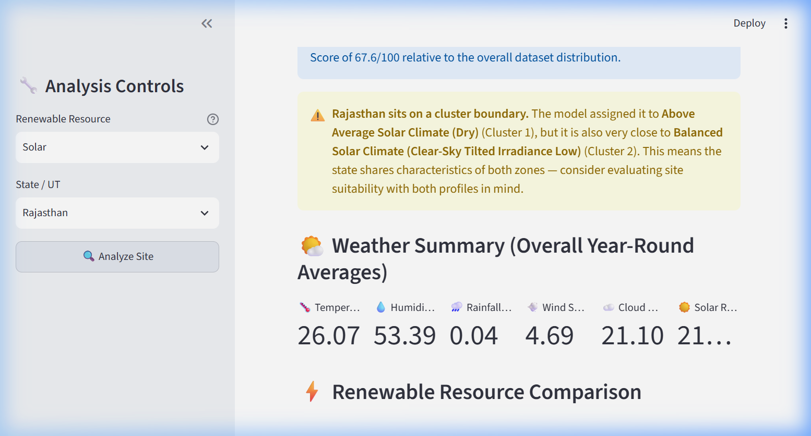
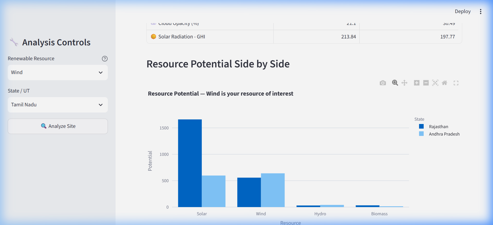

# Renewable Energy Site Suitability Analyzer

An advanced, data-driven machine learning application that analyzes meteorological and climate profiles across various states in India to determine site suitability for four major renewable energy sources: **Solar, Wind, Hydro, and Biomass**. 

Instead of a single combined clustering model, this project employs **four completely independent, resource-specific K-Means clustering pipelines** to automatically learn suitability profiles and climate categories directly from the historical weather data.

---

## 📌 Problem Statement
Identifying the optimal geographic locations for renewable energy infrastructure is a highly complex, multi-dimensional decision. Traditional methods often rely on hard-coded rules (e.g., `if solar > x`), manual weights, or static threshold-based decision engines. These approaches fail because:
1. They cannot adapt to varying ranges and distributions in new datasets.
2. They do not capture non-linear, multi-dimensional correlations between weather features.
3. They require heavy manual tuning and domain expertise to update.

This project solves this by leveraging **unsupervised K-Means clustering**. The models automatically discover natural groupings in the meteorological dataset. No manual labels, hardcoded rules, or pre-defined suitability thresholds are used during training. Domain knowledge is applied strictly **after** clustering to interpret and name the discovered zones.

---

## 📊 Dataset & Reference Source
The models are trained on the **Statewise Climate and Renewable Energy Dataset for India** (sourced from `STATEWISE_CLIMATE_RENEWABLEENERGY_DATA/Comprehensive_data.xlsx` or `renewable_energy_dataset.csv`). It contains monthly climate measurements across Indian States and Union Territories:
- **Spatial fields**: Latitude, Longitude, Name of State/UT
- **Temporal fields**: Year, Month
- **Meteorological fields**: Air Temperature, Surface Albedo, Clear-sky Diffuse/Direct/Tilted Irradiance, Cloud Opacity, Direct Normal Irradiance (DNI), Global Horizontal Irradiance (GHI), Global Tilted Irradiance (GTI), Precipitation Rate, Relative Humidity, Surface Pressure, Wind Speed at 100m, and pre-engineered resource indicators.

---

## 🛠️ Tools Used
- **Language**: Python 3.14
- **Data Manipulation**: Pandas, NumPy
- **Machine Learning**: Scikit-learn (`StandardScaler`, `KMeans`, `PCA`, `silhouette_score`)
- **Serialization**: Joblib (for model saving/loading)
- **Interactive Dashboard**: Streamlit
- **Data Visualization**: Plotly Express, Plotly Graph Objects
- **Excel Parsing**: Openpyxl

---

## 📐 Project Architecture & Workflow



### Execution Steps
1. **Data Pre-processing**: Drops exact duplicates, imputes missing values using group-wise medians, corrects data-entry column shifts (such as the Punjab air temperature anomaly), corrects physically impossible negative values, and standardizes column names.
2. **Feature Mapping**: suggested features for each model are lower-cased and dynamically mapped to actual dataset columns, utilizing `difflib.get_close_matches` to prevent mismatches.
3. **Stand-alone Standardization**: Each model has a separate `StandardScaler` fitted on its unique subset of features.
4. **PCA Variance Inspection**: PCA is fitted on the scaled features. If the minimum number of components needed to explain $\ge 95\%$ variance is strictly less than the number of features, PCA is applied; otherwise, it is skipped.
5. **Auto-Selection of K**: The number of clusters $K$ is determined automatically by training KMeans for $K \in [2, 10]$ and selecting the $K$ that maximizes the Silhouette Score.
6. **2D Visualization Mapping**: A separate 2D PCA is fit on the scaled features purely for visual plotting in the dashboard, ensuring scatter plots display clusters correctly regardless of the model's clustering configuration.
7. **Consolidated Output**: Predictions from all 4 models are merged into a single `models/clustered_dataset.csv`. Models, scalers, PCA files, and cluster profiles are stored separately under `models/solar/`, `models/wind/`, `models/hydro/`, and `models/biomass/`.

---

## 🤖 AI/ML & Software Components

### Unsupervised Clustering (K-Means)
Automatically groups states/months with similar meteorological distributions into distinct climate zones.

### Dimensionality Reduction (PCA)
Ensures the clustering model is not affected by multicollinearity in highly correlated solar features (DNI, GHI, GTI, clearsky equivalents), while retaining $95\%$ of original variance.

### Dynamic Cluster Interpretation Engine (`cluster_insights.py`)
Converts mathematical cluster centroids (z-scores) into human-readable details:
- **Dynamic Names**: Tiered suitability descriptions combined with dominant weather modifiers (e.g. `High Solar Potential Climate (Sunny)` or `Low Wind Potential Climate (Calm)`).
- **Dynamic Explanations**: Lists favorable or unfavorable weather drivers by sorting their z-scores relative to standard normal distributions.
- **Dynamic Recommendations**: Matches recommendations to statistical bands ($z \ge 1.0$ for High potential, $z \le -1.0$ for Poor potential).

---

## 🚀 How to Run the Project

### 1. Install Dependencies
Ensure you have Python installed, then run:
```bash
pip install -r requirements.txt
```

### 2. Run the Training Pipeline (Run once or on dataset change)
This will clean the raw data, train the 4 independent models, and save all artifacts under `models/`:
```bash
python train_pipeline.py
```

### 3. Start the Streamlit Dashboard
```bash
streamlit run app.py
```

---

## 📊 Model Performance

Upon running the training pipeline, the models automatically configure themselves:
- **Solar Model**: 10 features $\rightarrow$ PCA selected (6 components) $\rightarrow$ Optimal $K = 4$.
- **Wind Model**: 4 features $\rightarrow$ PCA skipped $\rightarrow$ Optimal $K = 2$.
- **Hydro Model**: 4 features $\rightarrow$ PCA skipped $\rightarrow$ Optimal $K = 8$.
- **Biomass Model**: 4 features $\rightarrow$ PCA skipped $\rightarrow$ Optimal $K = 4$.

---

## 💡 Results and Insights
- **Geographic Patterns**: The Solar model groups desert states (like Rajasthan) into high-suitability clusters with clear-sky modifiers, while humid, rainy states (like Kerala) are classified into low-suitability solar clusters.
- **Boundary Identification**: The dashboard identifies "Boundary States" where the cluster confidence is low ($\text{confidence} < 70\%$). These states sit on the transition border of two different climate zones and are ideal candidates for hybrid energy generation (e.g., Wind-Hydro).
- **Data-Driven Rankings**: States are ranked by resource suitability using the normal CDF of their scaled weather features, allowing stakeholders to compare different locations objectively.

---

## 📸 Demo Screenshots

### 1. Rajasthan Solar Suitability Overview
Shows dynamic cluster naming, Suitability Score, and dynamically generated recommendation.


### 2. State Comparison Tab
Compare two states side-by-side on climate metrics and resource potentials.


### 3. Interactive UI Demo
A short animation showing resource switching and state analysis:


---

## ⚠️ Limitations
- **Resolution Limit**: The dataset runs on broad state-level averages. In reality, site suitability varies at micro-geographical levels due to local topology (valleys, shade, roughness).
- **No Non-Climate Constraints**: The models do not take into account physical, political, or economic variables such as grid accessibility, local electricity demand, land usage laws, or proximity to transmission lines.
- **Unsupervised Bias**: K-Means assumes spherical clusters of similar sizes, which may not perfectly represent the irregular boundaries of natural climate zones.

---

## 🔮 Future Improvements
1. **High-Resolution Spatial Data**: Incorporate raster satellite telemetry data (e.g. GIS spatial maps) for precise coordinates instead of state averages.
2. **Economic & Infrastructure Layers**: Overlay transmission line coordinates, protected areas (forests, parks), and construction costs onto the predicted cluster profiles.
3. **Semi-Supervised Labeling**: Seed the clustering model with a few verified high-performance commercial wind/solar farms to ground the cluster suitability tiers in industry baselines.

---

## 👥 Team Members
- **Aditya Sharma**
- **Ansh Arora**
- **Devang Sharma**
- **Samar**
